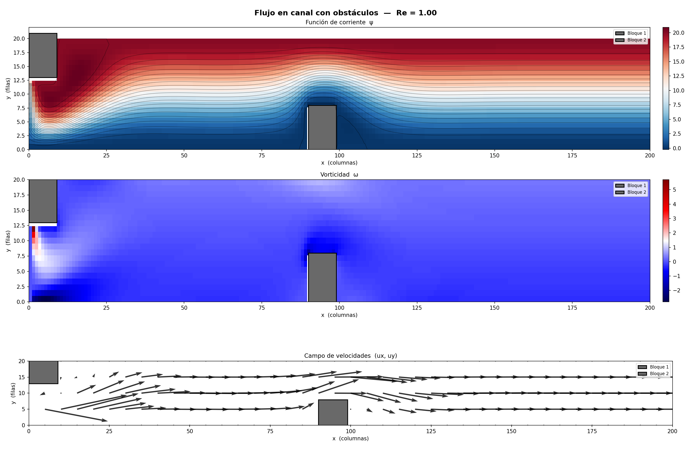

# Stream-function / Vorticity 2D Solver

Solución numérica de Navier–Stokes 2D incompresible en formulación ψ–ω, usando diferencias finitas, Newton–Raphson con *line search* y continuación en Reynolds.

## ⚙️ El problema

Flujo laminar en un canal con dos obstáculos sólidos:
- **Bloque 1** — esquina superior izquierda (conectado al techo).
- **Bloque 2** — zona inferior central (conectado al piso).

Se resuelve el sistema no lineal resultante de discretizar las PDEs sobre una malla de `200×20` nodos.

## 🧠 Cómo funciona

### Clasificación de nodos

No todos los nodos son incógnitas. La malla se divide en 6 tipos:

| Tipo | Descripción | ¿Incisión en NR? |
|------|-------------|:---:|
| `FREE` | Fluido interior, PDE completa | ✅ Activo |
| `BC_WALL` | Fluido pegado a obstáculo | ✅ Activo |
| `WALL` | Pared del canal (Dirichlet ψ, Thom ω) | ✅ Activo |
| `OUTLET` | Salida (Neumann) | ✅ Activo |
| `INLET` | Entrada (Dirichlet) | ❌ Fijo |
| `SOLID` | Interior del obstáculo | ❌ Fijo |

### Método numérico

1. **Newton–Raphson** con *backtracking line search* para resolver el sistema \(F(\psi,\omega)=0\).
2. **Jacobiana sparse** (~10 \(N_{\text{act}}\) no ceros, densidad < 0.1 %) en formato CSR, resuelta con `scipy.sparse.linalg.spsolve`.
3. **Continuación en Reynolds**: arranca desde Re ≈ 0 y sube gradualmente hasta el Re objetivo. Si un paso falla, subdivide automáticamente.

### Condiciones de contorno destacadas

- **Thom en paredes**: los nodos adyacentes a sólidos no resuelven la ecuación de transporte, sino una relación lineal que aproxima la derivada normal.
- **OUTLET con Neumann**: la frontera de salida se trata como nodo activo, acoplando el nodo de salida con su vecino interior.
