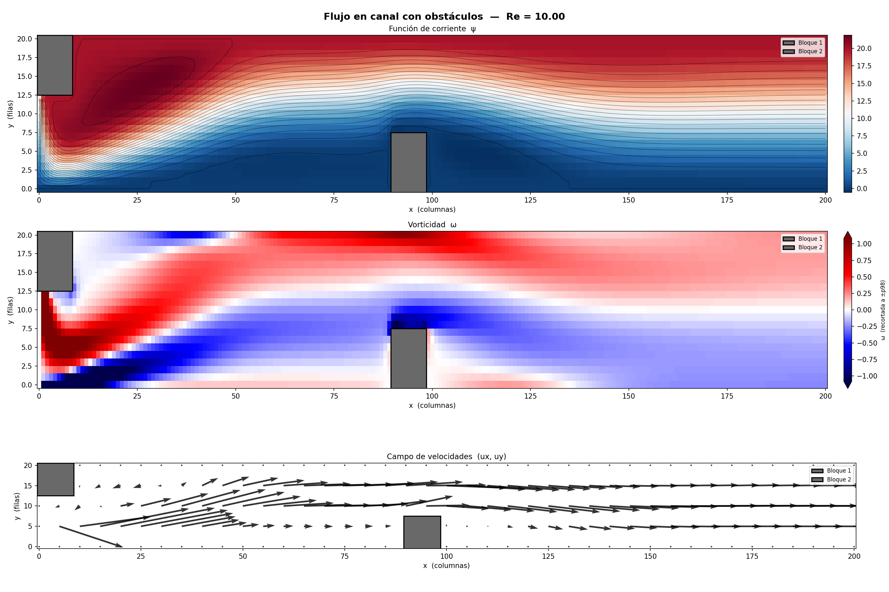

# Stream-function / Vorticity 2D Solver — rama `upwind-no-centradas`

Solución numérica de Navier–Stokes 2D incompresible en formulación ψ–ω, usando diferencias finitas, Newton–Raphson con *line search* y continuación en Reynolds.

> **Esta rama** discretiza el término convectivo de la ecuación de vorticidad con un esquema **upwind (donor-cell)** en lugar de diferencias centradas. Esto elimina las oscilaciones que aparecían a Reynolds moderado y permite resolver Re más altos en la misma malla. Ver [🌀 Esquema upwind](#-esquema-upwind-esta-rama).



## ⚙️ El problema

Flujo laminar en un canal con dos obstáculos sólidos:
- **Bloque 1** — esquina superior izquierda (conectado al techo).
- **Bloque 2** — zona inferior central (conectado al piso).

Se resuelve el sistema no lineal resultante de discretizar las PDEs sobre una malla de `200×20` nodos.

## 🧠 Cómo funciona

### Clasificación de nodos

No todos los nodos son incógnitas. La malla se divide en 6 tipos:

| Tipo | Descripción | ¿Incisión en NR? |
|------|-------------|:---:|
| `FREE` | Fluido interior, PDE completa | ✅ Activo |
| `BC_WALL` | Fluido pegado a obstáculo | ✅ Activo |
| `WALL` | Pared del canal (Dirichlet ψ, Thom ω) | ✅ Activo |
| `OUTLET` | Salida (Neumann) | ✅ Activo |
| `INLET` | Entrada (Dirichlet) | ❌ Fijo |
| `SOLID` | Interior del obstáculo | ❌ Fijo |

### Método numérico

1. **Newton–Raphson** con *backtracking line search* para resolver el sistema \(F(\psi,\omega)=0\).
2. **Jacobiana sparse** (~10 \(N_{\text{act}}\) no ceros, densidad < 0.1 %) en formato CSR, resuelta con `scipy.sparse.linalg.spsolve`.
3. **Continuación en Reynolds**: arranca desde Re ≈ 0 y sube gradualmente hasta el Re objetivo. Si un paso falla, subdivide automáticamente.

### Discretización del término convectivo

La convección de vorticidad se discretiza con **upwind de 1.er orden**; el resto del operador sigue en diferencias centradas. Detalles, motivación y compromisos en la [sección dedicada](#-esquema-upwind-esta-rama).

### Condiciones de contorno destacadas

- **Thom en paredes**: los nodos adyacentes a sólidos no resuelven la ecuación de transporte, sino una relación lineal que aproxima la derivada normal.
- **OUTLET con Neumann**: la frontera de salida se trata como nodo activo, acoplando el nodo de salida con su vecino interior.

## 🌀 Esquema upwind (esta rama)

### El problema que resuelve

La ecuación de transporte de vorticidad tiene un término convectivo no lineal
\(u_x\,\partial_x\omega + u_y\,\partial_y\omega\), con \(u_x=\partial_y\psi\), \(u_y=-\partial_x\psi\).
En la rama `main` este término usa **diferencias centradas**. Ese esquema solo es
estable si el **Reynolds de celda** es pequeño:

$$\mathrm{Re}_{\text{celda}} = R\,|u|\,h < 2$$

Cuando se supera ese umbral (p. ej. a Re = 10, donde \(\mathrm{Re}_{\text{celda}}\)
llega a ~50 en la mayoría de la malla), el coeficiente que multiplica al vecino
—`1 − (R/2)·u_x`— **cambia de signo**. La matriz deja de ser una M-matriz, se
pierde el principio del máximo discreto y aparecen **oscilaciones espurias**:
vorticidad de signo alternado tipo tablero de ajedrez, saltos bruscos en las
líneas de corriente y velocidades infladas. Newton–Raphson converge igual (a la
solución *exacta del sistema discreto*), pero ese sistema discreto es el que está
mal planteado.

### La solución

Se sustituye la derivada centrada de ω por una derivada **río arriba** (*upwind*),
eligiendo el vecino según el signo de la velocidad local:

```
si u_x ≥ 0:  ∂ω/∂x ≈ (ω[i]   − ω[i−1]) / h     (hacia atrás)
si u_x < 0:  ∂ω/∂x ≈ (ω[i+1] − ω[i])   / h     (hacia adelante)
```

Con esto los coeficientes fuera de la diagonal **nunca cambian de signo** y la
diagonal se refuerza: la M-matriz se recupera para **cualquier** Reynolds de celda.

El cambio es **local** a los nodos `FREE` en `compute_F` y `compute_J`; Newton–Raphson,
la Jacobiana sparse, el *line search*, la continuación en Re, el Poisson de ψ y las
condiciones Thom quedan intactos. La Jacobiana analítica del nuevo término está
verificada contra diferencias finitas (error ~1e-8).

### Ventajas ✅

- **Estabilidad incondicional**: sin oscilaciones sin importar \(\mathrm{Re}_{\text{celda}}\). Permite subir el Reynolds en la misma malla.
- **Respeta cotas físicas**: al conservar la M-matriz, ω no desarrolla máximos/mínimos espurios (a Re = 10, ω se mantiene en `[−6.3, 5.4]` en vez de dispararse a `[−31.7, 20.2]`).
- **Mejor condicionamiento** → Newton converge en menos iteraciones a Re alto.
- **Cambio mínimo**: solo el término convectivo; el método global no se altera.

### Desventajas ⚠️

- **Precisión de 1.er orden** (\(O(h)\)) en la convección, frente al \(O(h^2)\) del esquema centrado.
- **Difusión numérica artificial**: suaviza los gradientes finos, ensancha las capas de cortante y **sub-predice la intensidad pico** de la vorticidad y de las recirculaciones. En la práctica el "Reynolds efectivo" resuelto es algo menor que el nominal (la difusión numérica escala con \(|u|\,h\)).
- **No diferenciable en \(u=0\)** (el *switch* de dirección introduce un *kink*); en la práctica Newton lo tolera bien, pero puede añadir alguna iteración cerca de puntos de estancamiento.

### Posibles mejoras futuras

- **Esquema híbrido / power-law** (Patankar): mezcla centrado y upwind según \(\mathrm{Re}_{\text{celda}}\) para recuperar 2.º orden donde el flujo es lento.
- **Deferred correction**: iterar upwind (estable) con una corrección centrada explícita para acercarse a 2.º orden manteniendo estabilidad.
- **Refinar la malla** para bajar \(\mathrm{Re}_{\text{celda}}\) y reducir la difusión numérica.

| | `main` (centrado) | `upwind-no-centradas` |
|---|---|---|
| Orden de precisión (convección) | 2.º \(O(h^2)\) | 1.er \(O(h)\) |
| Estabilidad | solo si \(\mathrm{Re}_{\text{celda}}<2\) | incondicional |
| Difusión numérica | nula | sí (∝ \(\|u\|\,h\)) |
| Re alcanzable (malla 200×20) | bajo (≈ 2) | moderado (≥ 10) |
| Oscilaciones a Re = 10 | sí | no |
